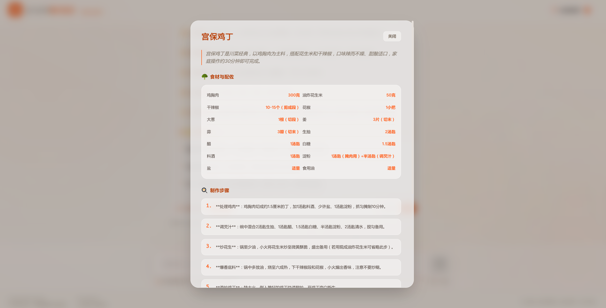

# DishMind

DishMind 是一个中文食谱 RAG 助手项目，面向“今天吃什么”“某道菜怎么做”“现有食材能做什么”这类日常烹饪场景。项目将本地 Markdown 菜谱知识库、FAISS 向量索引、BM25 混合检索与 OpenAI-compatible 大模型结合起来，并提供一个可直接使用的 Web 前端。

## 项目功能

- 基于本地食谱知识库进行中文问答
- 支持菜谱推荐、做法讲解、食材清单查询、追问上下文理解
- 支持菜名直匹配，减少具体菜名查询时的误召回
- 支持向量检索 + BM25 检索 + RRF 重排
- 支持按分类、难度做元数据过滤
- 支持前端 Markdown 渲染、回答复制、菜谱收藏
- 支持收藏菜谱详情查看与交互式分步做菜模式
- 支持索引清单校验，数据变化后自动重建向量索引

## 页面截图

### 首页 / 对话区


### 交互与详情展示



## 项目架构

整体调用链如下：

```text
React 前端
  -> Express 接口层(frontend/server.ts)
  -> Python bridge(backend_bridge.py)
  -> RecipeRAGSystem(main.py)
  -> 数据准备 / 索引构建 / 检索优化 / 生成集成
  -> 本地 Markdown 菜谱 + FAISS + 大模型 API
```

### 目录结构

```text
DishMind/
├── deploy/                  # Docker 反向代理配置
├── docker/                  # Docker 专用依赖与辅助文件
├── assets/                  # README 截图资源
├── data/recipes/            # 本地 Markdown 食谱知识库
├── frontend/                # React + Vite + Express 前端与接口层
├── rag_modules/             # RAG 各功能模块
├── backend_bridge.py        # Node 与 Python RAG 的桥接进程
├── config.py                # RAG 配置
├── main.py                  # Python RAG 主程序
├── requirements.txt         # cook-rag 环境导出的 Python 依赖
├── start.sh                 # 一键启动脚本
└── vector_index/            # 本地持久化向量索引
```

### Python RAG 模块

- `rag_modules/data_preparation.py`
  负责扫描 `data/recipes` 下的 Markdown 食谱，补充 `category`、`dish_name`、`difficulty` 等元数据，并按 Markdown 标题进行结构化分块。
- `rag_modules/index_construction.py`
  负责加载 `BAAI/bge-small-zh-v1.5` 嵌入模型，构建或加载 FAISS 索引，并通过 `manifest.json` 判断索引是否与当前数据快照一致。
- `rag_modules/retrieval_optimization.py`
  负责向量检索、BM25 检索、RRF 重排以及基于元数据的过滤检索。
- `rag_modules/generation_integration.py`
  负责查询分类、查询重写与回答生成，当前通过 OpenAI-compatible SDK 调用 `deepseek`、`moonshot` 或 `openai`。

### 前后端协作方式

- `frontend/server.ts` 暴露 `/api/chat` 和 `/api/health`
- Node 服务支持两种 bridge 启动方式：
- 本地开发默认通过 `conda run -n cook-rag python backend_bridge.py` 拉起 Python 进程
- Docker/服务器可切换为直接执行 `python backend_bridge.py`
- `backend_bridge.py` 使用 stdin/stdout 与 Node 通信，不改动原有 RAG 主流程
- 前端只和 Node 接口交互，不直接调用 Python 或模型 API

## 检索与问答流程

1. 加载本地 Markdown 菜谱文档。
2. 按 `# / ## / ###` 标题切分为结构化 chunk。
3. 基于 `BAAI/bge-small-zh-v1.5` 生成向量并构建 FAISS 索引。
4. 用户提问后先进行 query router 分类。
5. 对非列表问题执行查询重写。
6. 优先做菜名直匹配；未命中时走混合检索。
7. 使用向量检索 + BM25 检索后通过 RRF 重排。
8. 根据问题类型生成推荐列表或详细步骤回答。

## 环境要求

### Python

- 建议使用 `conda` 管理环境
- 项目默认 Python 环境名为 `cook-rag`
- 根目录 `requirements.txt` 已按当前 `cook-rag` 环境重新导出

### Node.js

- 需要安装 Node.js 与 `npm`
- 前端依赖定义在 [frontend/package.json](/home/wenhai-li/Code/Agent/DishMind/frontend/package.json)

### 模型与 API Key

根目录 `.env.example` 已给出示例，当前后端默认配置如下：

- 嵌入模型：`BAAI/bge-small-zh-v1.5`
- LLM provider：`deepseek`
- LLM model：`deepseek-v4-pro`

需要至少配置以下之一：

- `DEEPSEEK_API_KEY`
- `OPENAI_API_KEY`
- `MOONSHOT_API_KEY`

如果 Hugging Face 官方源访问不稳定，可在根目录 `.env` 中增加：

```bash
HF_ENDPOINT=https://hf-mirror.com
```

## 本地开发部署

### 1. 创建并准备 conda 环境

```bash
conda create -n cook-rag python=3.11 -y
conda activate cook-rag
pip install -r requirements.txt
```

### 2. 配置环境变量

在项目根目录创建 `.env`：

```bash
DEEPSEEK_API_KEY=your_deepseek_api_key
# OPENAI_API_KEY=your_openai_api_key
# MOONSHOT_API_KEY=your_moonshot_api_key
# HF_ENDPOINT=https://hf-mirror.com
```

前端可按需参考 [frontend/.env.example](/home/wenhai-li/Code/Agent/DishMind/frontend/.env.example)：

```bash
PORT=3000
```

### 3. 安装前端依赖

```bash
cd frontend
npm install
```

### 4. 启动项目

从项目根目录启动：

```bash
./start.sh
```

启动后默认访问：

```text
http://localhost:3000
```

`start.sh` 会做以下事情：

- 检查 `conda` 和 `npm` 是否存在
- 检查 `cook-rag` 环境是否存在
- 检查 `frontend/node_modules` 是否已安装
- 在 `frontend/` 下启动 `npm run dev`
- 首次请求或服务预热时拉起 Python RAG bridge

## 生产部署方式

当前仓库同时提供 Docker 部署方案和非 Docker 部署方案。对服务器上线而言，优先推荐 Docker。

## Docker 部署

仓库已补齐以下文件，可直接用于服务器部署：

- [Dockerfile](/home/wenhai-li/Code/Agent/DishMind/Dockerfile)
- [docker-compose.yml](/home/wenhai-li/Code/Agent/DishMind/docker-compose.yml)
- [docker/requirements.docker.txt](/home/wenhai-li/Code/Agent/DishMind/docker/requirements.docker.txt)
- [deploy/caddy/Caddyfile](/home/wenhai-li/Code/Agent/DishMind/deploy/caddy/Caddyfile)
- [.env.docker.example](/home/wenhai-li/Code/Agent/DishMind/.env.docker.example)

### Docker 方案说明

- 应用容器内直接运行 `python backend_bridge.py`，不再依赖 conda
- 前端使用多阶段构建，运行时只保留生产构件
- 默认使用以下国内镜像源：
- `apt`：`mirrors.aliyun.com`
- `pip`：清华 PyPI 镜像
- `npm`：`registry.npmmirror.com`
- 反向代理使用 Caddy，默认绑定 `dishmind.hihili.cn`
- Caddy 会自动申请和续签 HTTPS 证书，前提是服务器的 `80/443` 端口已放行

### 服务器部署步骤

1. 在服务器上安装 Docker 和 Docker Compose Plugin。
2. 拉取项目代码到服务器，例如 `/srv/dishmind`。
3. 复制 Docker 环境变量模板：

```bash
cp .env.docker.example .env.docker
```

4. 编辑 `.env.docker`，填入至少一个模型密钥：

```bash
DEEPSEEK_API_KEY=your_deepseek_api_key
```

5. 启动服务：

```bash
docker compose up -d --build
```

6. 验证服务：

```bash
docker compose ps
docker compose logs -f app
docker compose logs -f caddy
```

如果服务器安全组和系统防火墙已经放行 `80/443`，Caddy 会为 `https://dishmind.hihili.cn` 自动签发证书。

### Docker 运行细节

- `app` 服务监听容器内 `3000`
- `caddy` 服务对外暴露 `80/443`
- 向量索引持久化到 Docker volume `dishmind_vector_index`
- Hugging Face 缓存持久化到 `dishmind_hf_cache`
- sentence-transformers 缓存持久化到 `dishmind_sentence_cache`

### Docker 常用命令

```bash
docker compose up -d --build
docker compose pull
docker compose logs -f app
docker compose restart app
docker compose down
```

### 1. 构建前端与 Node 服务

```bash
cd frontend
npm install
npm run build
```

构建后会生成：

- `frontend/dist/`：前端静态资源
- `frontend/dist/server.cjs`：Node 服务端入口

### 2. 启动生产服务

```bash
cd frontend
NODE_ENV=production PORT=3000 node dist/server.cjs
```

### 3. 非 Docker 生产部署建议

- 使用 `conda` 预先创建并固定 `cook-rag` 环境
- 通过 `systemd`、`supervisor` 或容器进程管理 Node 服务
- 在 Nginx 或 Caddy 后挂载 `3000` 端口
- 将模型 API Key 以环境变量方式注入，不要写入仓库
- 首次上线前可先本地预热一次索引，避免第一次请求等待过长

## 配置说明

核心配置位于 [config.py](/home/wenhai-li/Code/Agent/DishMind/config.py)：

- `data_path`：知识库目录，默认 `data/recipes`
- `index_save_path`：向量索引目录，默认 `vector_index`
- `embedding_model`：嵌入模型名称或本地路径
- `llm_provider`：`deepseek` / `moonshot` / `openai`
- `llm_model`：具体模型名称
- `top_k`：检索返回数量
- `temperature`、`max_tokens`：生成参数

## 数据与索引

- 食谱源数据保存在 `data/recipes/**.md`
- 按文件路径自动推断菜品分类
- 按 Markdown 内容中的星级符号推断难度
- 索引持久化目录为 `vector_index/`
- 当文档集合或 chunk 指纹变化时，系统会自动重建索引

## 接口说明

### `GET /api/health`

返回桥接服务状态：

- `ready`
- `running`
- `pendingRequests`

### `POST /api/chat`

请求体示例：

```json
{
  "message": "宫保鸡丁怎么做？",
  "history": [
    {
      "role": "user",
      "content": "推荐几个简单荤菜"
    }
  ]
}
```

响应体示例：

```json
{
  "text": "# 宫保鸡丁\n..."
}
```

## 当前默认技术栈

- Python
- LangChain
- FAISS
- sentence-transformers
- OpenAI-compatible LLM API
- React 19
- Vite
- Express
- TypeScript

## 已知注意事项

- `requirements.txt` 是基于当前 `cook-rag` 环境导出的完整快照，包含环境中已安装但未必在运行时严格必需的包。
- Docker 构建使用的是 [docker/requirements.docker.txt](/home/wenhai-li/Code/Agent/DishMind/docker/requirements.docker.txt) 这份精简运行时依赖，而不是完整 `pip freeze` 快照。
- Python bridge 现在支持 `conda` 和 `direct` 两种启动模式，可通过 `PYTHON_BRIDGE_MODE` 切换。
- 首次构建索引和首次加载嵌入模型可能较慢。
- 如果访问 Hugging Face 官方源受限，嵌入模型初始化会失败，需要使用镜像或改为本地模型目录。
